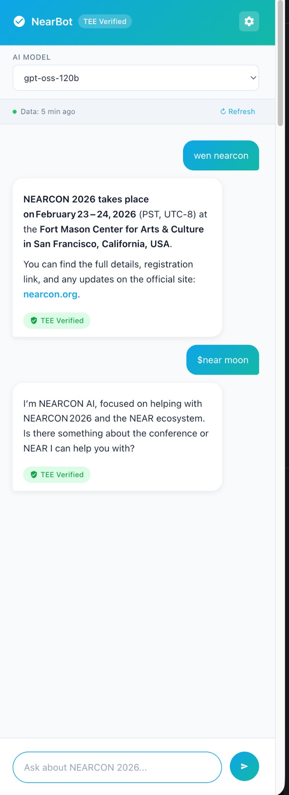
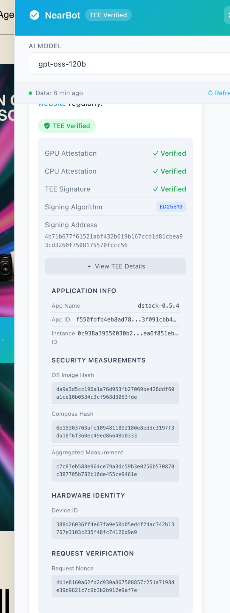
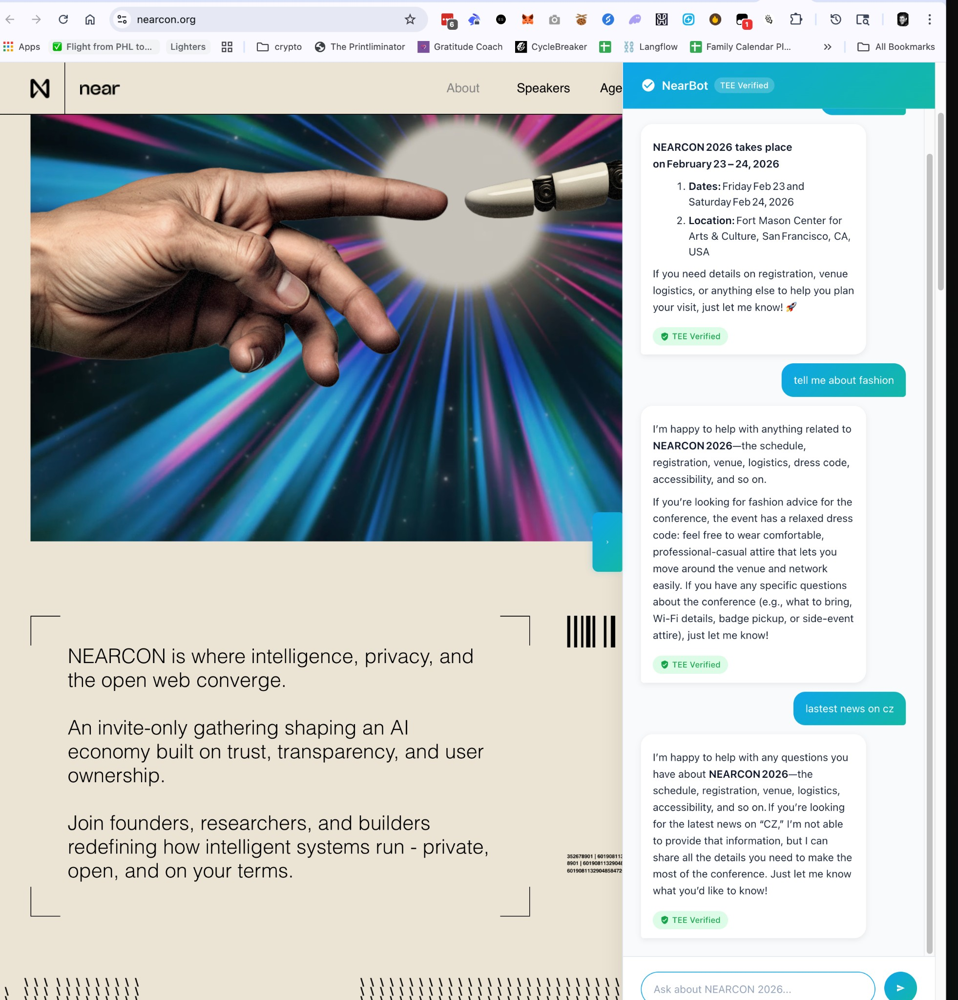
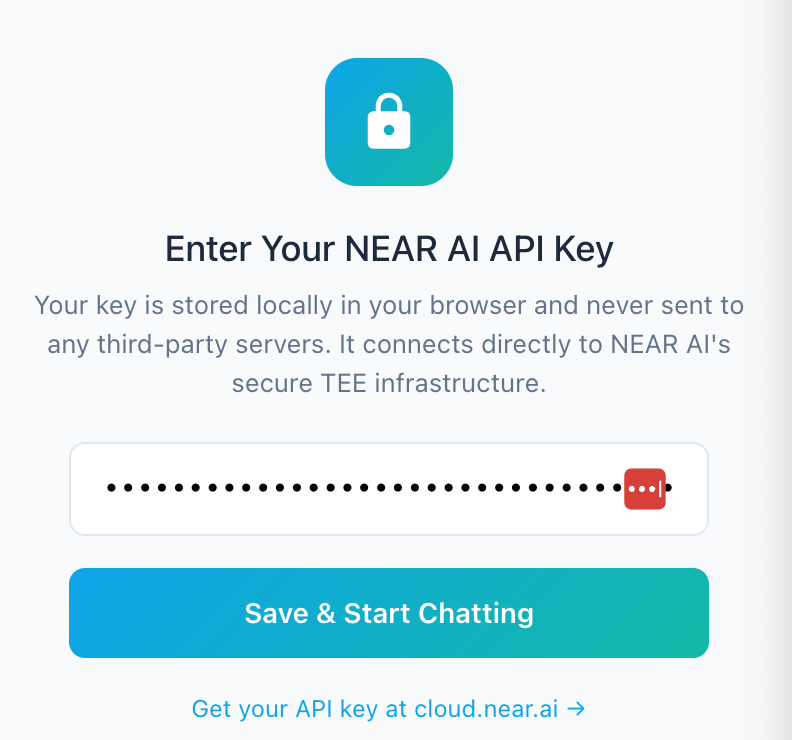
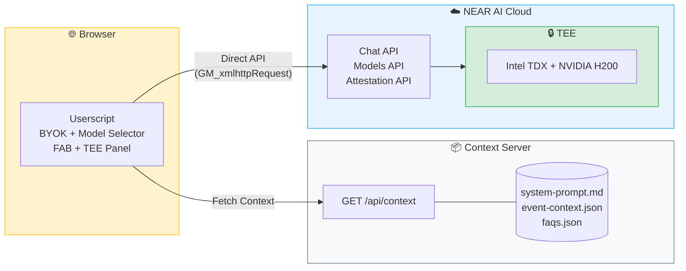
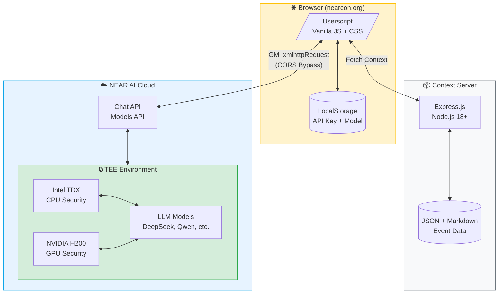

# NEARCON AI Chat Assistant

[](https://cloud.near.ai)
[](https://docs.near.ai)
[](#-bring-your-own-key-byok)
[](LICENSE)

An AI-powered chat assistant for **NEARCON 2026** that runs on NEAR AI Cloud with cryptographically verifiable responses using Trusted Execution Environments (TEE).


## 📸 Screenshots

<table>
  <tr>
    <td align="center"><strong>Chat Widget</strong></td>
    <td align="center"><strong>TEE Verification Details</strong></td>
  </tr>
  <tr>
    <td></td>
    <td></td>
  </tr>
  <tr>
    <td align="center"><strong>Desktop Integration</strong></td>
    <td align="center"><strong>API Key Setup</strong></td>
  </tr>
  <tr>
    <td></td>
    <td></td>
  </tr>
</table>

## ✨ Features

### 🔑 Bring Your Own Key (BYOK)
- **User-provided API keys** - Each user brings their own NEAR AI API key
- **Local storage only** - Keys stored in browser, never sent to third-party servers
- **Direct API connection** - Userscript connects directly to NEAR AI Cloud
- **Key management UI** - Easy setup, update, and clear key functionality

### 🤖 Multi-Model Support
- **Dynamic model selector** - Choose from available NEAR AI models
- **Model persistence** - Selected model saved across sessions
- **Live model list** - Fetches available models from NEAR AI API
- **Models include**: DeepSeek V3.1, Kimi K2, GPT-OSS-120B, Qwen3, GLM 4.6, and more

### 🔒 TEE Verification with Expanded Details
- **Hardware attestation** - GPU (NVIDIA) and CPU (Intel TDX) verification
- **Cryptographic signatures** - Every response signed with TEE private key
- **Expandable verification panel** - View detailed TEE information:
  - Signing algorithm (ED25519/ECDSA)
  - Signing address
  - Application info (App Name, App ID, Instance ID)
  - Security measurements (OS Image Hash, Compose Hash, Aggregated Measurement)
  - Hardware identity (Device ID)
  - Request verification (Nonce)

### 🛡️ Tight Guardrails
- **Event-focused responses** - AI stays on-topic for NEARCON 2026
- **Graceful deflection** - Politely redirects off-topic questions
- **No hallucination** - Only answers based on provided context
- **Professional tone** - Consistent, helpful assistant persona

### 📦 Separation of Duties (Context System)
- **Backend context server** - Manages event data separately from userscript
- **System prompt isolation** - Prompt template stored in `backend/data/system-prompt.md`
- **Structured event data** - JSON files for event context and FAQs
- **Auto-refresh on load** - Context automatically loads when server starts
- **Manual refresh button** - Users can refresh context from the UI

### ⚡ Real-time Features
- **Context status indicator** - Shows when data was last updated
- **Refresh button** - Manually refresh event context
- **Streaming responses** - Real-time AI response streaming
- **Beautiful markdown** - Full markdown rendering with tables, lists, links

## 🏗️ Architecture



## 📁 Project Structure

```
nearcon_ai/
├── backend/
│   ├── server.js              # Express server for context API
│   ├── context-loader.js      # Loads and compiles system prompt
│   ├── nearai-client.js       # NEAR AI Cloud SDK client (optional)
│   ├── data/
│   │   ├── system-prompt.md   # AI assistant system prompt template
│   │   ├── event-context.json # NEARCON 2026 event details
│   │   └── faqs.json          # Frequently asked questions
│   ├── package.json           # Node.js dependencies
│   └── .env.example           # Environment variables template
├── userscript/
│   └── nearcon-chat.user.js   # Tampermonkey/Greasemonkey userscript
├── screenshots/               # UI screenshots for documentation
│   ├── chat-widget.png
│   ├── chat-desktop.png
│   ├── tee-verification.png
│   ├── api-key-setup.png
│   └── api-key-settings.png
└── README.md
```

## 🚀 Getting Started

### Prerequisites

- **Node.js** 18+ and npm
- **NEAR AI API Key** - Get one at [cloud.near.ai](https://cloud.near.ai)
- **Tampermonkey** or **Greasemonkey** browser extension

### Backend Setup (Context Server)

The backend serves event context to the userscript. It does NOT handle AI requests - those go directly from the userscript to NEAR AI.

1. **Clone the repository**

   ```bash
   git clone https://github.com/your-username/nearcon-ai.git
   cd nearcon-ai/backend
   ```

2. **Install dependencies**

   ```bash
   npm install
   ```

3. **Start the server**

   ```bash
   npm start
   ```

   The context server will start at `http://localhost:3000` and automatically load all event data.

### Userscript Installation

1. Install [Tampermonkey](https://www.tampermonkey.net/) (Chrome/Edge) or [Greasemonkey](https://www.greasespot.net/) (Firefox)

2. Create a new userscript and paste the contents of `userscript/nearcon-chat.user.js`

3. Visit [nearcon.org](https://nearcon.org) - a chat FAB will appear in the bottom-right corner

4. Click the chat button and enter your NEAR AI API key when prompted

5. Start chatting! Your key is stored locally and connects directly to NEAR AI.

## 🔑 Bring Your Own Key (BYOK)

This project uses a **BYOK architecture** where each user provides their own NEAR AI API key:

### Why BYOK?

| Benefit | Description |
|---------|-------------|
| **Privacy** | Your API key never touches our servers |
| **Direct Connection** | Requests go straight to NEAR AI Cloud |
| **Cost Control** | You manage your own usage and credits |
| **Security** | No shared keys, no central point of compromise |

### How It Works

1. **First Visit**: User is prompted to enter their NEAR AI API key
2. **Validation**: Key is tested against NEAR AI's `/models` endpoint
3. **Storage**: Valid key is saved to browser's local storage
4. **Usage**: All subsequent requests use the stored key directly
5. **Management**: Users can update or clear their key anytime

### Getting an API Key

1. Visit [cloud.near.ai](https://cloud.near.ai)
2. Sign in with GitHub or Google
3. Navigate to **API Keys** section
4. Create a new key and copy it
5. (Optional) Top up credits in the **Credits** section

## 📡 API Reference

### Context API (Backend Server)

#### Get Event Context

```http
GET /api/context
```

**Response:**
```json
{
  "systemMessage": {
    "role": "system",
    "content": "You are NearBot, a helpful AI assistant..."
  },
  "event": {
    "name": "NEARCON 2026",
    "dates": { ... },
    "location": { ... }
  },
  "lastUpdated": "2025-12-12T10:00:00.000Z"
}
```

#### Health Check

```http
GET /health
```

### NEAR AI API (Direct from Userscript)

The userscript connects directly to NEAR AI Cloud:

- **Chat Completions**: `POST https://cloud-api.near.ai/v1/chat/completions`
- **Models List**: `GET https://cloud-api.near.ai/v1/models`
- **Attestation**: `GET https://cloud-api.near.ai/v1/attestation/report?model=...`

## 🔐 TEE Verification

Every AI response includes cryptographic verification through a multi-layer security chain:

### Verification Layers

1. **Hardware Root of Trust** - NVIDIA and Intel hardware attestation
2. **TEE Attestation** - Proves secure execution environment
3. **Cryptographic Signature** - Every response signed with TEE private key
4. **Verifiable Details** - Full transparency into security measurements

### Expanded TEE Details

Click "View TEE Details" on any response to see:

| Section | Details |
|---------|---------|
| **Application Info** | App Name, App ID, Instance ID |
| **Security Measurements** | OS Image Hash, Compose Hash, Aggregated Measurement |
| **Hardware Identity** | Device ID |
| **Request Verification** | Request Nonce |

### Verification Status

| Badge | Meaning |
|-------|---------|
| 🟢 TEE Verified | Response verified via GPU + CPU attestation |
| 🟡 Pending | Verification in progress |
| 🔴 Failed | Verification failed (potential tampering) |

## 🛡️ Guardrails & Safety

The AI assistant has strict guardrails to ensure helpful, on-topic responses:

### What NearBot Will Do

- ✅ Answer questions about NEARCON 2026 event details
- ✅ Provide venue, schedule, and logistics information
- ✅ Explain NEAR ecosystem and AI capabilities
- ✅ Help with registration and attendance questions
- ✅ Share speaker and session information

### What NearBot Won't Do

- ❌ Provide financial or investment advice
- ❌ Answer questions unrelated to NEARCON/NEAR
- ❌ Make up information not in its context
- ❌ Engage in harmful or inappropriate discussions
- ❌ Share personal opinions or speculation

## 🛠️ Technology Stack



| Component | Technology |
|-----------|------------|
| Backend Runtime | Node.js 18+ |
| Context Server | Express.js |
| AI Platform | NEAR AI Cloud (Direct) |
| LLM Models | DeepSeek V3.1, GPT-OSS-120B, Qwen3, etc. |
| Security | Intel TDX + NVIDIA TEE |
| CORS Bypass | GM_xmlhttpRequest (Userscript) |
| Frontend | Vanilla JS + CSS (Userscript) |
| Key Storage | Browser LocalStorage / GM_setValue |

## 📋 Event Information

The assistant is pre-configured with NEARCON 2026 event details:

- **Event**: NEARCON 2026 - The Premier AI Industry Conference
- **Dates**: February 23-24, 2026 (PST, UTC-8)
- **Location**: Fort Mason Center for Arts & Culture, San Francisco, CA
- **Website**: [nearcon.org](https://nearcon.org)

## 🔧 Configuration

### Updating Event Data

Edit the files in `backend/data/`:

- **`system-prompt.md`** - AI persona and behavior instructions
- **`event-context.json`** - Event details, venue, schedule
- **`faqs.json`** - Common questions and answers

The context automatically reloads when the server starts.

### Customizing the UI

Edit `userscript/nearcon-chat.user.js`:

- Styles are in the `GM_addStyle` block
- Toggle behavior controlled by `isOpen` state
- FAB position: bottom-right corner (20px offset)

## 🤝 Contributing

Contributions are welcome! Please follow these steps:

1. Fork the repository
2. Create a feature branch (`git checkout -b feature/amazing-feature`)
3. Commit your changes (`git commit -m 'Add amazing feature'`)
4. Push to the branch (`git push origin feature/amazing-feature`)
5. Open a Pull Request

## 📄 License

This project is licensed under the MIT License - see the [LICENSE](LICENSE) file for details.

## 🔗 Resources

- [NEAR AI Cloud Documentation](https://docs.near.ai)
- [NEAR AI Cloud Console](https://cloud.near.ai)
- [NEARCON 2026 Official Website](https://nearcon.org)
- [Intel TDX Overview](https://www.intel.com/content/www/us/en/developer/tools/trust-domain-extensions/overview.html)
- [NVIDIA Confidential Computing](https://www.nvidia.com/en-us/data-center/solutions/confidential-computing/)

---

<p align="center">
  Built with 💚 for <strong>NEARCON 2026</strong>
  <br>
  Powered by <a href="https://cloud.near.ai">NEAR AI Cloud</a> with TEE Verification
  <br><br>
  <strong>v2.2.0</strong> • BYOK • Multi-Model • TEE Verified
</p>
